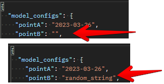

# Configuration

## Introduction

configuarations are top-level settings that are set up to guide the model in it's simulation. The following attributes are available in the Configuaration schema as listed below

- PointA
- PointB

## PointA

> Definition

This is the time the simulation is set to begin running. This value is set to be less than or equals PointB

> Invalid

The PointA json key in the model_config json schema holds values of date or datetime datatype to depict the starttime of the project simulation. This cannot hold random or empty values that don't follow the datetime pattern as shown in the image below.

## PointB

> Definition

This is the current time of the simulation. This is always higher or equal PointA

> Invalid

The PointB json key in the model_config json schema holds values of date or datetime datatype to depict the current time of the project simulation. This cannot hold random or empty values that don't follow the datetime pattern as shown in the image below.

