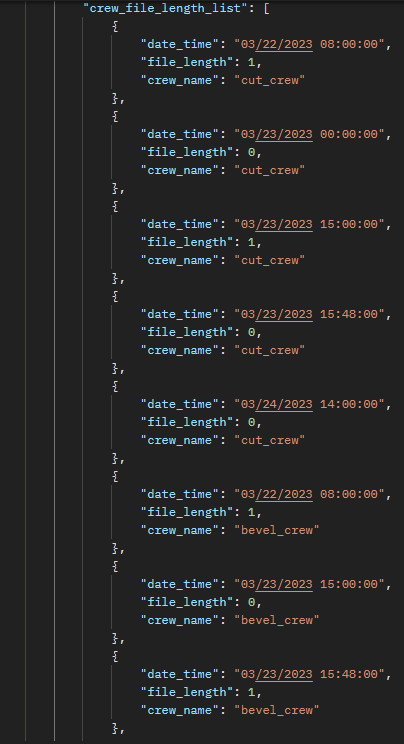

# Crew File Length

## Introduction

crew_file_length_list is a json schema that holds the attributes of the length of the queue that occured in the simulation run. It has a list datatype which contains the following attributes as listed below.

- date_time
- file_length
- crew_name

## date_time

> Definition

date_time is a key in the crew_file_length_list json schema that holds the value of the datetime of the length of the crew at various time spots in the simulation run.

## file_length

> Definition

file_length is the key in the crew_file_length_list json schema that holds the value of the file length in the simulation run. this is usually an integer which represents the length of the crew_file_length.

## crew_name

> Definition

crew_name is the key in the crew_file_length_list json schema that holds the value of the crew_name in the simulation run. this is usually set up before running the simulation but it is returned to identify the various crews in the output.

## Sample crew_file_length_list

