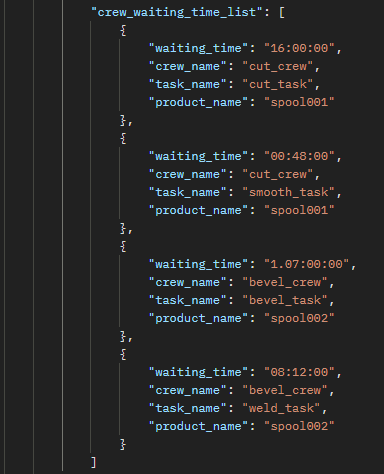

# Crew Waiting Time

## Introduction

Crew waiting times are json schema in the simulation output that details the wait times of the crews at various time spots all through the simulation run. This is a list which can output multiple crew_wait_times at different time spots. The crew_waiting_time_list contains the following attributes as listed below.

- waiting_time
- crew_name
- task_name
- product_name

## waiting_time

> Definition

waiting_time is the key in the crew_waiting_time_list json schema which shows the waiting time of the crew at every point in the simulation run. This could be a combination of days,hours, minutes and seconds of wait time

## crew_name

> Definition

crew_name is the key in the crew_waiting_time_list json schema which shows the name of the crew that is waiting. This is the value that was added in the simulation input

## task_name

> Definition

task_name is the key in the crew_waiting_time_list json schema which shows the name of the task that is waiting. This is the value that was added in the simulation input

## product_name

> Definition

product_name is the key in the crew_waiting_time_list json schema which shows the name of the product that is waiting. This is the value that was added in the simulation input

## Sample Crew Waiting Time

