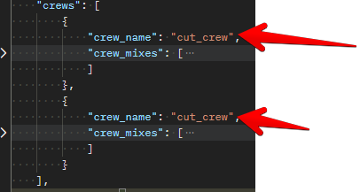
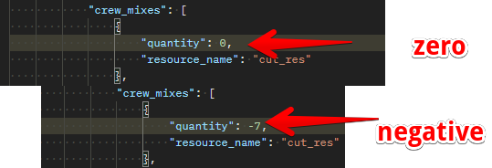
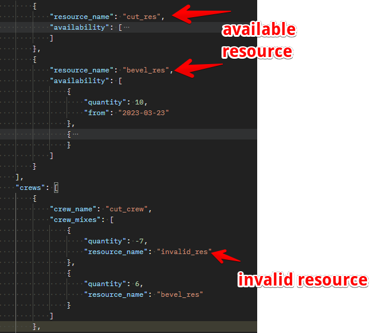
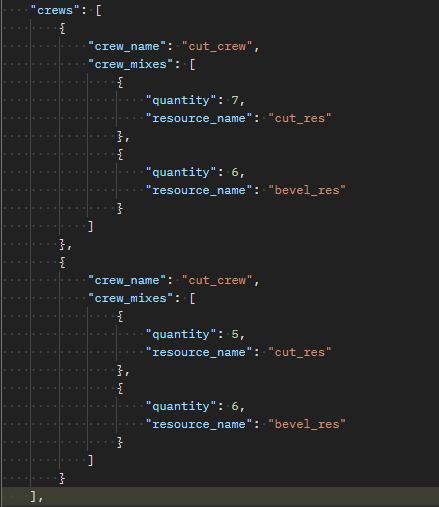

# Crews

## Introduction

Crews are entities used to collate various resources together needed for running a simulation for a project. The following fields are needed  components of the crew entity in the json structure. 

- crew_name
- crew_mixes

## crew_name

> Definition

crew_name is a key in the json_schema which represents a name assigned to a crew. The name value can be a combination of alpha_numeric values. e.g. **crew001** 

> Invalid

>> crew_name : This value should be unique for every new crew added to run the simulation. We can't have two crew with the same name as shown in the image below.

## crew_mixes 

> Definition

 This entity is used for linking the resource to the crew in the simulation. This is a list value and can have multiple resources used in a crew. It has two fields which includes  **quantity** and **resources**

> Invalid

>> quantity : the quantity key accepts integer values that are greater than zero. It won't run successfully when passed negatvie or zero values

>> resources : this is the name of the resource that is linked to the crew. This has to match the name of the resource created earlier. for e.g if we have a resource named cut_resource, this will be referenced in the crewmix with it's name.

> Invalid

>> resources : a resource name that doesn't exists as part of the created resources cannot be referenced in the crewmix as well as empty values.

## sample_crew

