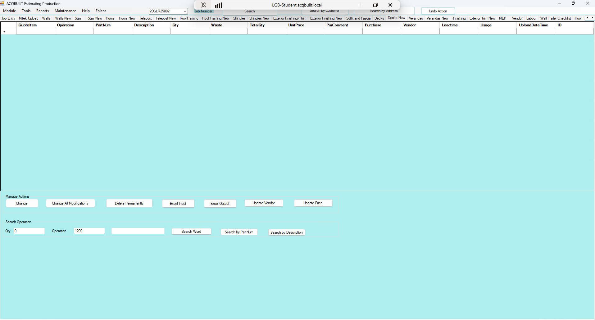

# Decks New TAB

## Introduction

Decks New tab allows you to add a BOQ for a specific JOB from EPICOR to be applied to the Decks. There are two major Actions available on the Decks tab

- Manage Actions
- Search Operation

### Manage Actions

This enables you to perform the following actions

- Change a Deck Item from BOQ
- Change all Decks modifications from BOQ
- Delete Decks BOQ Permanently
- Excel Decks Input 
- Excel Decks Output
- Update Decks Vendor
- Update Decks Price

### Search Operation

This enables you to perform the following operations

- Enter the **QTY**, **Operation** and **Search Word**.
- Perform Decks Search in EPICOR
- Perform Decks Search by **Part Num** in EPICOR
- Perform Decks Search by **Description** in EPICOR 

## Screenshots

