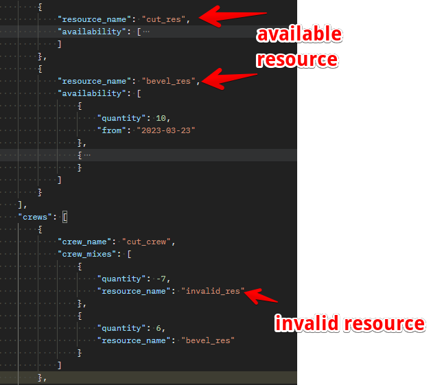
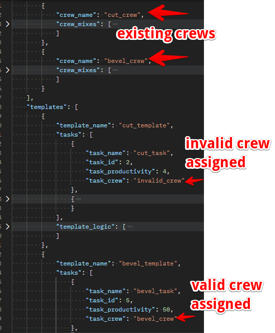
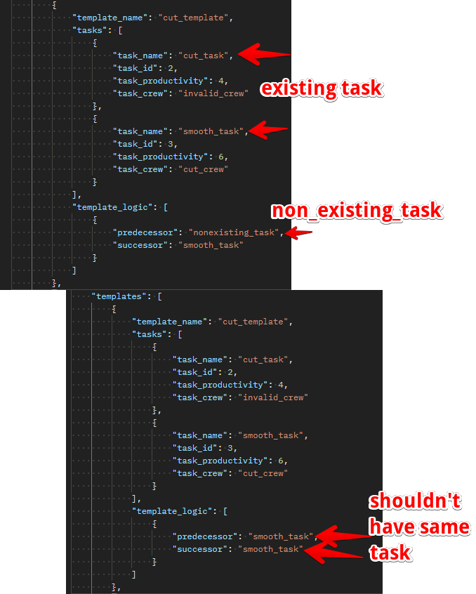
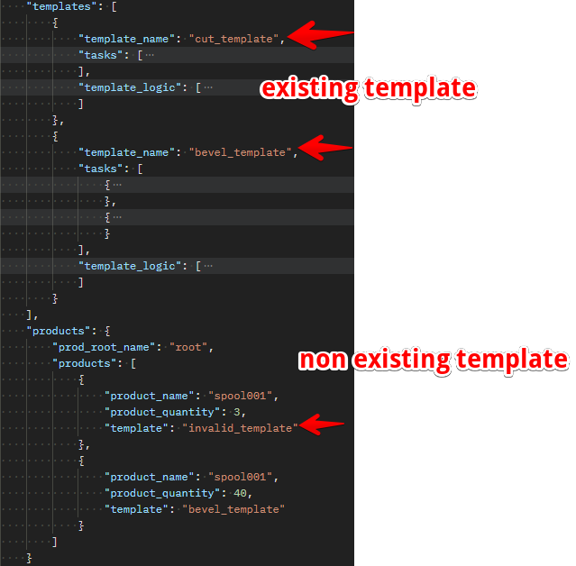

# Dependencies

## Introduction

This section describes the constraints and dependencies that are available in the model and simulation engine.

## Crews

Crews are dependent on Resources. The crew_mixes in the crew json schema must reference existing resources created earlier. The image shown below highlights a crew referencing a resource that doesn't exist which will fail when running the simulation.

## Tasks

Tasks are dependent on crews. The tasks schema present in the templates must reference existing crews created earlier. The image shown below highlights a task referencing a crew that doesn't exist which will fail when running the simulation.

## TemplateLogic

Template logics are dependent on tasks. The template_logic schema present in the templates must reference existing tasks created earlier. The images shown below highlights a template_logic referencing a task that doesn't exist which will fail when running the simulation.

## Products

Products are dependent on templates. The product schema must reference existing templates created earlier. The images shown below highlights a product referencing a template that doesn't exist which will fail when running the simulation.

