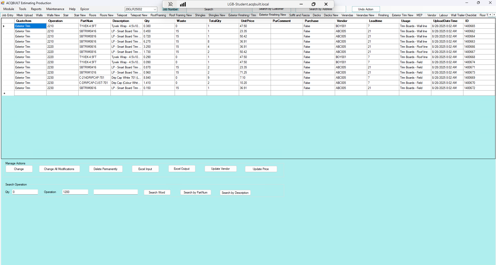

# Exterior Finishing New TAB

## Introduction

Exterior Finishing New tab allows you to add a BOQ for a specific JOB from EPICOR to be applied to the Exterior Finishing. There are two major Actions available on the Exterior Finishing tab

- Manage Actions
- Search Operation

### Manage Actions

This enables you to perform the following actions

- Change an Exterior Finishing Item from BOQ
- Change all Exterior Finishing modifications from BOQ
- Delete an Exterior Finishing BOQ Permanently
- Excel Exterior Finishing Input 
- Excel Exterior Finishing Output
- Update Exterior Finishing Vendor
- Update Exterior Finishing Price

### Search Operation

This enables you to perform the following operations

- Enter the **QTY**, **Operation** and **Search Word**.
- Perform Exterior Finishing Search in EPICOR
- Perform Exterior Finishing Search by **Part Num** in EPICOR
- Perform Exterior Finishing Search by **Description** in EPICOR 

## Screenshots

