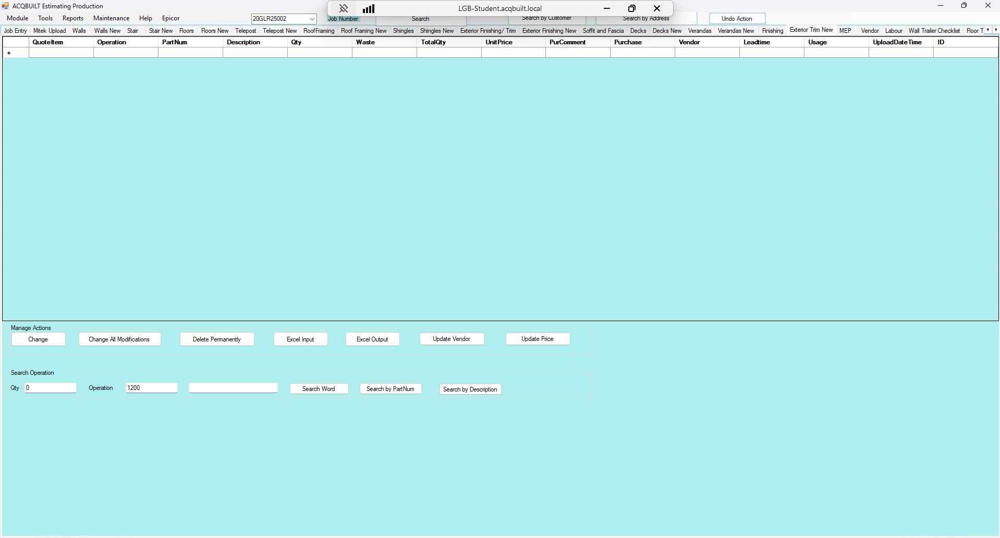

# Exterior Trim New TAB

## Introduction

Exterior Trim New tab allows you to add a BOQ for a specific JOB from EPICOR to be applied to the Exterior Trim. There are two major Actions available on the Exterior Trim tab

- Manage Actions
- Search Operation

### Manage Actions

This enables you to perform the following actions

- Change a Deck Item from BOQ
- Change all Exterior Trim modifications from BOQ
- Delete Exterior Trim BOQ Permanently
- Excel Exterior Trim Input 
- Excel Exterior Trim Output
- Update Exterior Trim Vendor
- Update Exterior Trim Price

### Search Operation

This enables you to perform the following operations

- Enter the **QTY**, **Operation** and **Search Word**.
- Perform Exterior Trim Search in EPICOR
- Perform Exterior Trim Search by **Part Num** in EPICOR
- Perform Exterior Trim Search by **Description** in EPICOR 

## Screenshots

