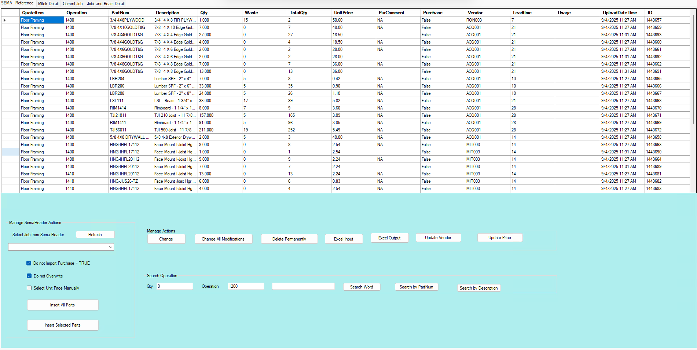
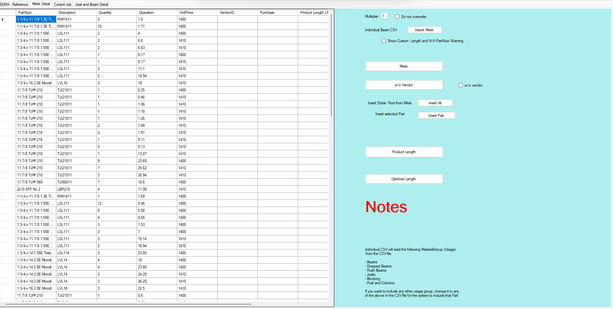
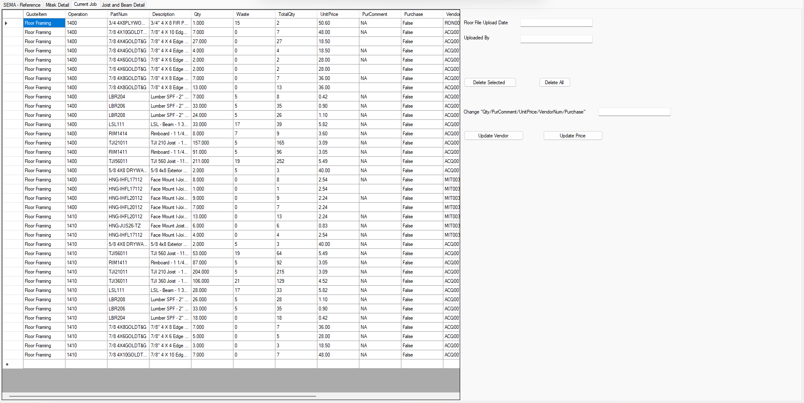
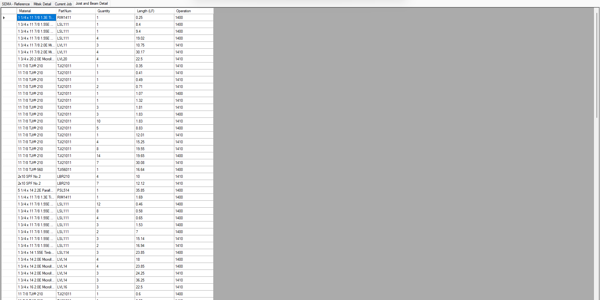
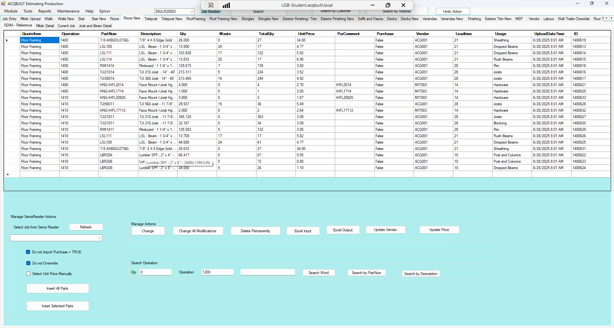

# Floors New TAB

## Introduction

Floors New tab allows you to add a BOQ for a specific JOB from EPICOR to be applied to the Floor. This tab has four sub tabs namely:

- SEMA Reference TAB
- Mitek Detail TAB
- Current Job TAB
- Joist and Beam Detail TAB

### SEMA Reference TAB

This Tab provides the regular interface for performing the following actions listed below ;

- Manage SemaReader Actions
- Manage Actions
- Search Operations
- Manage Actions

    > Manage SemaReader Actions : This lets you perform the following actions listed below ;
        
        -> Import Floors BOQ from SEMA
        -> Insert All Floor Parts 
        -> Insert Selected Floors Parts

    > Manage Actions : This enables you to perform the following actions

        -> Change a Floor Item from BOQ
        -> Change all Floors modifications from BOQ
        -> Delete a Floor BOQ Permanently
        -> Excel Input BOQ Floor Sheets 
        -> Excel Output BOQ Floor Sheet
        -> Update Floors Vendor
        -> Update Floors Price

    > Search Operation : This enables you to perform the following operations

        -> Enter the QTY, Operation and Search Word for the Floor Item.
        -> Perform Floor Materials Search in EPICOR
        -> Perform Search by Floor Materials Part Num in EPICOR
        -> Perform Search by Floor Description in EPICOR 

    > Manage Actions : This enables you to perform the following actions

        -> Change an Item from BOQ
        -> Change all modifications from BOQ
        -> Delete a BOQ Permanently
        -> Excel Input 
        -> Excel Output
        -> Update Vendor
        -> Update Price

> Screenshots of the SEMA-Reference TAB

### Mitek Detail TAB

This tab provides the regular interface with the following buttons/Actions

- Import Mitek
- Mitek
- w/o Vendor
- Insert All
- Insert Part
- Product Length
- Optimize Length

> Screenshot of the Mitek Detail TAB is shown below

### Current Job TAB

This tab provides the regular interface for the Floors BOQ with the following buttons/Actions.

- Delete All
- Delete Selected
- Update Vendor
- Update Price

> Screenshot of the Current Job Tab is shown below

### Joist and Beam Detail TAB

This tab provides the regular interface for the Joist and Beam Details 

> Screenshot of the Joist and Beam Detail is shown below

>Screenshot of the Floors New TAB
