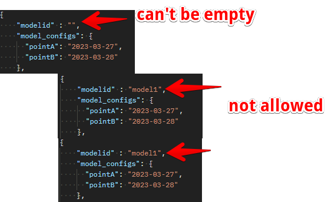

# ModelId

## Introduction

ModelId is an attribute set up strictly for the database search, data retrieval, update and deletion (CRUD operations)

> Invalid

This value shouldn't be set as empty string and must also be unique and it's usually set by the users.

