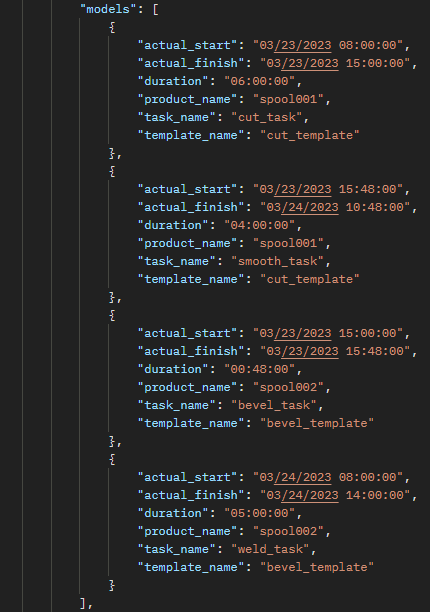

# Models

## Introduction

The model json schema is used to depict the entire result from the simulation run. It contains the following attributes as listed below. The models are list 
- model_id
- actual_start
- actual_finish
- duration
- product_name
- task_name
- template_name

## model_id
> Definition

model_id is the id of the model that was set before the simulation run. This is passed back for db purposes.

## actual_start

> Definition

actual_start is a key in the model output json schema which represents the time the model starts simulating at every point in time in the simulation run. This could be a combination of datetime

## actual_finish

> Definition

actual_finish is a key in the model output json schema which represents the time the model stops simulating at every point in time in the simulation run before going to the next task if there are any. This could be a combination of datetime

## duration

> Definition

duration is the time it took for the completion of a specific task in a simulation run. This could be a combination of days, hours, minutes and seconds.

## product_name

> Definition

product_name is a key in the model output json schema which represents the name of the product the template and task are associated with. This is usually the name of the product supplied before running the simulation.

## task_name

> Definition

task_name is a key in the model output json schema which represents the specific task at every point in the simulation run. This is usually the name of the task supplied before running the simulation

## template_name

> Definition

template_name is a key in the model output json schema which represents the specific template associated with a product at every point in the simulation run. This is usually supplied before running the simulation.

## sample model output

