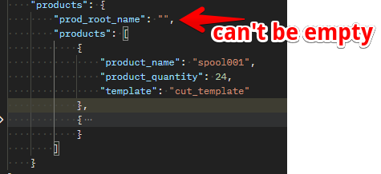
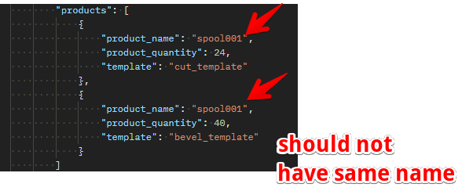
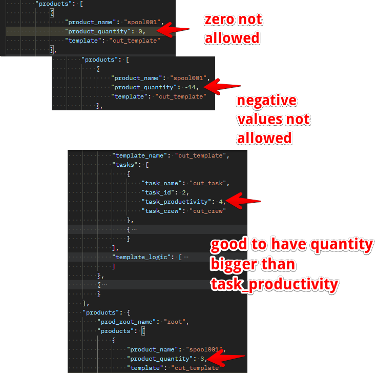
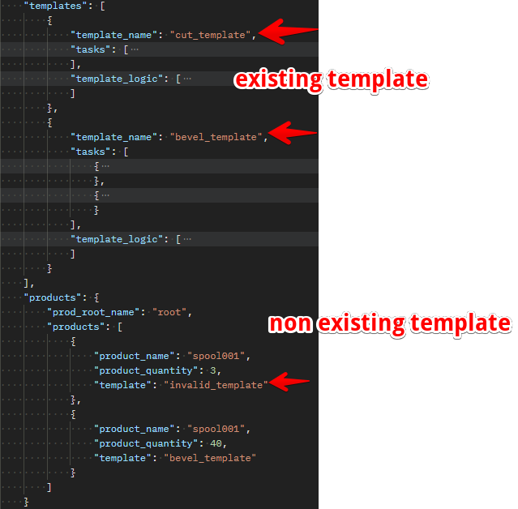
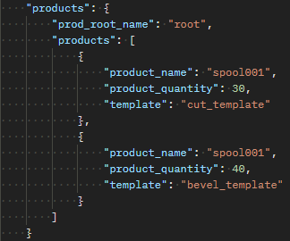

# Products

## Introduction

Products defines the actual product or project we wish to simulate. These includes the templates associated with each product to successfully run a simulation. The products contains two fields as listed below

- prod_root_name
- products

## prod_root_name

> Definition

prod_root_name is the root name for the product you want to simulate. This should be unique and can contain alphanumeric values.

> Invalid

>> prod_root_name : prod_root_name is added by the user and should be unique for every simulation run for the sole purpose of data integrity.  

## products

> Definition

products is a json schema list containing the attributes needed to define and generate a project. It contains the following attributes as listed below.

- product_name
- product_quantity
- template

### product_name

> Definition

This is a key in the json products schema which represents a name assigned to a product. The name value can be a combination of alpha_numeric values. e.g. **spool001** 

> Invalid

>> product_name : This value should be unique for every new produt added to run the simulation. We can't have two products with the same name as shown in the image below.

### product_quantity

> Definition
 
This is a key in the json schema which represents the overal units to be produced for that specific product. This takes a datatype of double value.

> Invalid

>> product_quantity : This key shouldn't contain negative values, zero or values less than the productivity. If these values are there, it will prevent the simulation from running successfully.

### template

> Definition

This is a key in the products json schema which defines the name of template needed to build a product. This is a string datatype whose values must correspond to a template previously created in the system. 

> Invalid

>> template : This value cannot be left blank and shouldn't include names of templates that don't exist. 

## sample product

