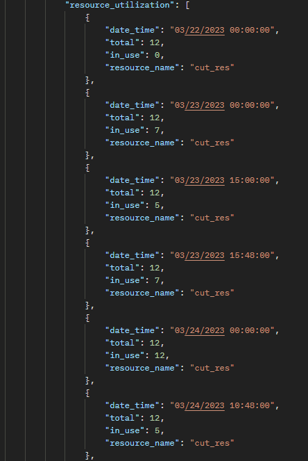

# Resource Utilization

## Introduction

resource_utilization  is the json schema which represents the utilization of the resources all through the simulation run lifecyce. This is a list and it contains the following attributes listed below.

- date_time
- total
- in_use
- resource_name

## date_time

> Definition

date_time is the key which represents the value current date and time in the resource utilization outputs. 

## total

> Definition

total is the number of resource available at every point in the simulation run. This is a double datatype

## in_use

> Definition

in_use is the number of resource being used at every point in the simulation run. This is a double datatype

## resource_name

> Definition

resource_name is the name of the resource utilized which is usually the resource created before running the simulation

## Sample resource utilization schema

