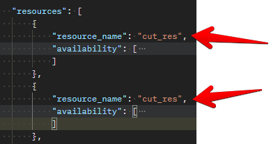
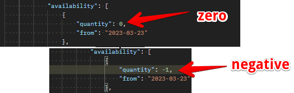
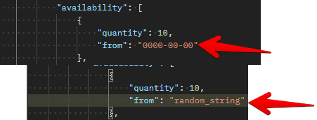
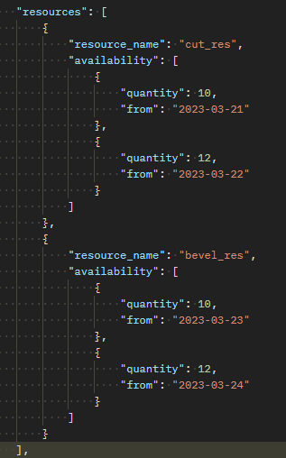

# Resources

## Introduction

Resources are useful entities set up by the user to successfully run a simulation engine. These are list values so they can contain multiple resources. The various fields in a resource includes the following listed below. 

- resource_name
- availability

## resource_name

> Definition

resource_name is a key in the json_schema which represents a name assigned to a resource. The name value can be a combination of alpha_numeric values. e.g. **resource001** 

> Invalid

>> resource_name : This value should be unique for every new resource added to run the simulation. We can't have two resources with the same name as shown in the image below.

## availability 

> Definition

availability is used to represent the available resources at every point in the simulation run. It is a list containing two keys namely **quantity** and **from** . quantity is used to keep count of the number of resources available and the from is the datetime value which describes the start time the resource became available. 

> Invalid

>> quantity : the quantity key accepts integer values that are greater than zero. It won't run successfully when passed negatvie or zero values

>> from : the from key accepts actual datetime or date the resource will be available. The simulation engine uses this value at every point in the simulation run to determine available resource. The simulation won't run when sample values like the ones below are passed 

## sample resource

