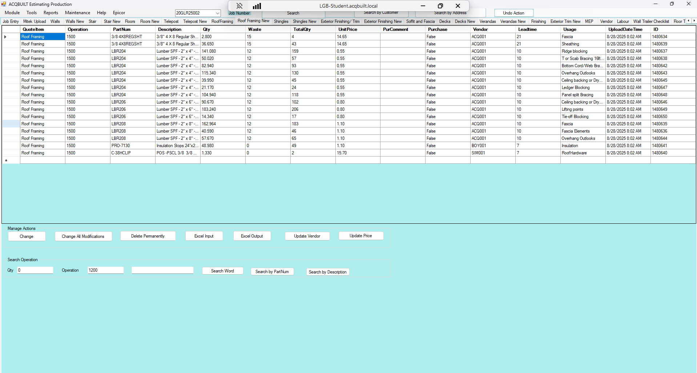

# Roof Framing New TAB

## Introduction

Roof Framing New tab allows you to add a BOQ for a specific JOB from EPICOR to be applied to the Roof Framing. There are two major Actions available on the Roof Framing tab

- Manage Actions
- Search Operation

### Manage Actions

This enables you to perform the following actions

- Change a Roof Frame Item from BOQ
- Change all Roof Frame modifications from BOQ
- Delete a Roof Frame BOQ Permanently
- Excel Roof Frame Input 
- Excel Roof Frame Output
- Update Roof Frame Vendor
- Update Roof Frame Price

### Search Operation

This enables you to perform the following operations

- Enter the **QTY**, **Operation** and **Search Word**.
- Perform Roof Frame Search in EPICOR
- Perform Roof Frame Search by **Part Num** in EPICOR
- Perform Roof Frame Search by **Description** in EPICOR 

## Screenshots

