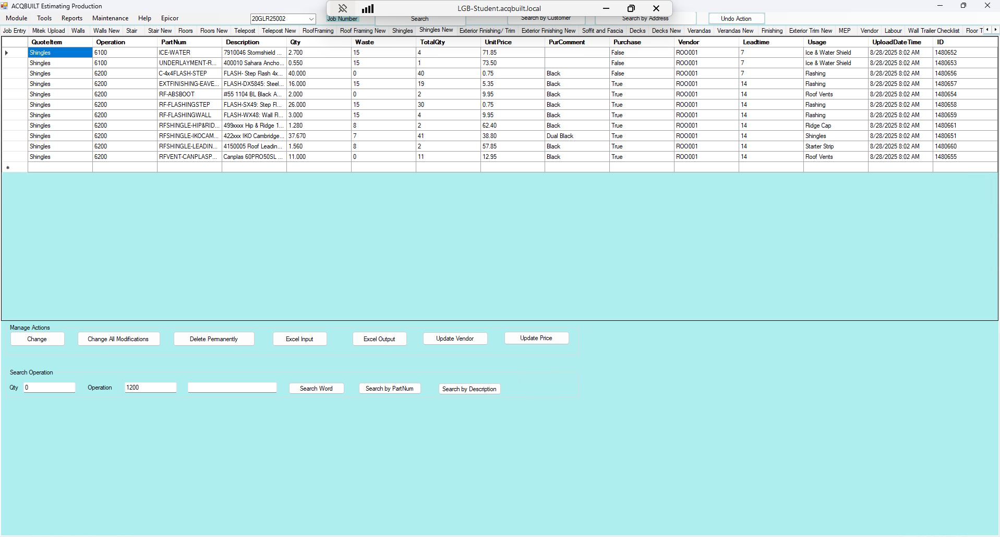

# Shingles New TAB

## Introduction

Shingles New tab allows you to add a BOQ for a specific JOB from EPICOR to be applied to the Shingles. There are two major Actions available on the Shingles tab

- Manage Actions
- Search Operation

### Manage Actions

This enables you to perform the following actions

- Change a Shingles Item from BOQ
- Change all Shingles modifications from BOQ
- Delete a Shingles BOQ Permanently
- Excel Shingles Input 
- Excel Shingles Output
- Update Shingles Vendor
- Update Shingles Price

### Search Operation

This enables you to perform the following operations

- Enter the **QTY**, **Operation** and **Search Word**.
- Perform Shingles Search in EPICOR
- Perform Shingles Search by **Part Num** in EPICOR
- Perform Shingles Search by **Description** in EPICOR 

## Screenshots

