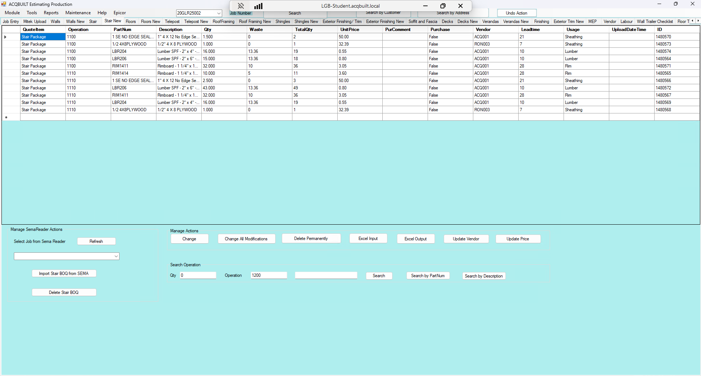

# Stair New TAB

## Introduction

Stair New tab allows you to add a BOQ for a specific JOB from EPICOR to be applied to the Stair. There are three major Actions available on the Walls tab

- Manage SemaReader Actions
- Manage Actions
- Search Operation

### Manage SemaReader Actions

- Import a Stair Job from Sema Reader 
- Import Stair BOQ from SEMA
- Delete Stair BOQ

### Manage Actions

This enables you to perform the following actions

- Change a Stair Item from BOQ
- Change all Stair modifications from BOQ
- Delete a Stair BOQ Permanently
- Excel Stair Input 
- Excel Stair Output
- Update Stair Vendor
- Update Stair Price

### Search Operation

This enables you to perform the following operations

- Enter the **QTY**, **Operation** and **Search Word**.
- Perform Stair Search in EPICOR
- Perform Stair Search by **Part Num** in EPICOR
- Perform Stair Search by **Description** in EPICOR 

## Screenshots

