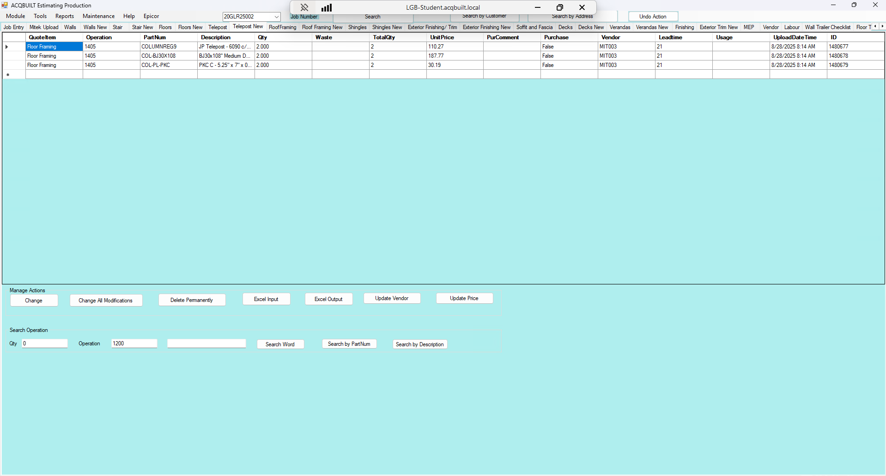

# Telepost New TAB

## Introduction

Telepost New tab allows you to add a BOQ for a specific JOB from EPICOR to be applied to the Telepost. There are two major Actions available on the Walls tab

- Manage Actions
- Search Operation

### Manage Actions

This enables you to perform the following actions

- Change a Telepost Item from BOQ
- Change all Telepost modifications from BOQ
- Delete a Telepost BOQ Permanently
- Excel Telepost Input 
- Excel Telepost Output
- Update Telepost Vendor
- Update Telepost Price

### Search Operation

This enables you to perform the following operations

- Enter the **QTY**, **Operation** and **Search Word**.
- Perform Telepost Search in EPICOR
- Perform Telepost Search by **Part Num** in EPICOR
- Perform Telepost Search by **Description** in EPICOR 

## Screenshots

