# Templates

## Introduction

Templates are the project workflows that highlights the complete tasks required to build a product. These could be gotten from historical data or set up by the user intending to run the simulation.This is a list so it can contain multiple templates. The templates has the following attributes in it's json schema as listed below.

- template_name
- tasks
- template_logic

## template_name

> Definition

template_name is a key in the json_schema which represents a name assigned to a template. The name value can be a combination of alpha_numeric values. e.g. **template001** 

> Invalid

>> template_name : This value should be unique for every new template added to run the simulation. We can't have two template with the same name as shown in the image below.

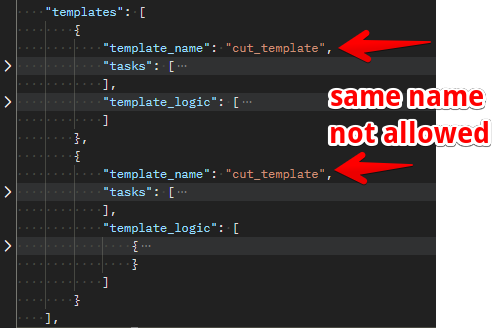

## tasks

> Definition

tasks key represent specific activities or actions that are performed in each phase of the project. The tasks has a list datatype which allows for entry of multiple tasks for a simulation run. The tasks entity has the following fields as listed below.

- task_name
- task_id
- task_productivity
- task_crew

### task_name

> Definition

task_name key is a unique name assigned to a new task usually added by the user running the simulation. The task_name can be a string character, an alpha-numeric value or a unique number. It is always advisable to give a descriptive name which matches the task for instance in a spool simulation, the welding operation could be given a **weld_task**.

> Invalid

>> task_name : This value should be unique for every new task added to the list. We can't have two task with similar name for our simulation.

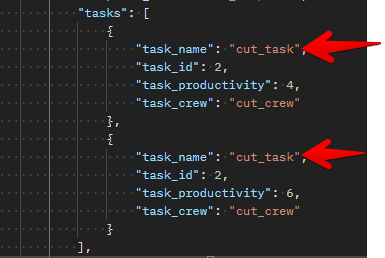

### task_id

> Definition

task_id is a unique id usually generated in the engine. This is non_trivial for a simulation run, However we can add an id for the sole reason of search in the database system. 

> Invalid

>> task_id : task_id values doesn't have any invalid data as this is usually generated from the Simulation engine. However for data integrity in the db, it is always advisable to generate unique task ids from the user's input.

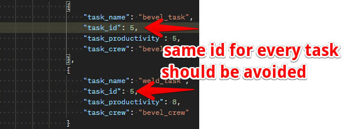

### task_productivity

> Definition

task_productivity is a value in hours used to depict how many hours are required to produce a single unit of a product. 

> Invalid

>> task_productivity : This value should not be more than the supplied quantity, can't be negative values or zero. 

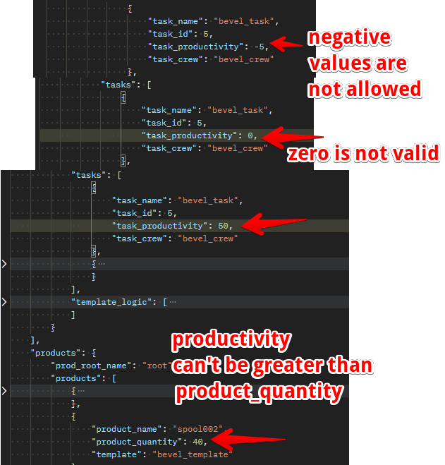

### task_crew

> Defintion

task_crew is the name of the crew that will handle the specified task. This has to match any of the crews created earlier on. A task_crew could be used by different task.

> Invalid

>> task_crew : This value should not include crew names that doesn't exist in the crew. This means it must reference existing crews.

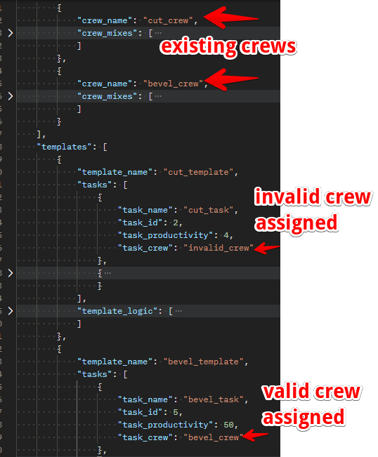

## template_logic

> Definition

template_logic represents the sequence the task follows to build a product. This is a list which can contain multiple template logics for a template. The template_logic contains the following attributes

- predecessor
- successor
- finish_to_start_lag
- start_to_start_lag
- finish_to_finish_lag

### predecessor

> Definition

predecessor key in the template_logic json schema is used to capture the preceding task that the simulation would run first. This key holds values for task names created earlier.

> Invalid

>> predecessor : This value should not include task that are not in the already created task list. The predecessor and successor cannot be the same task. 

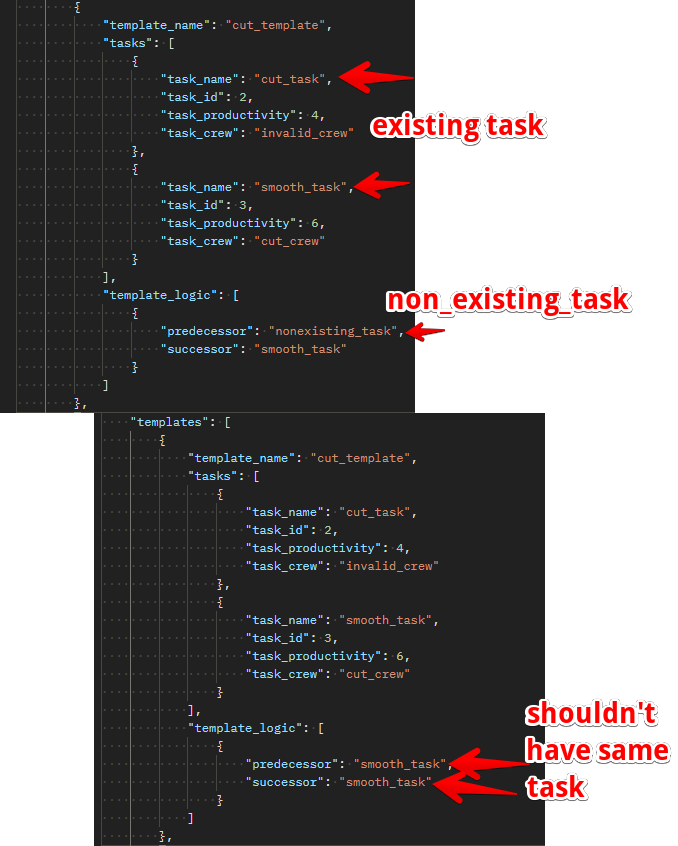

### successor

> Definition

successor key in the template_logic json schema is used to capture the task that follows the predecessor task. Similar to the predecessor, this value must be tasks names created earlier in the task schema.

> Invalid

>> successor : This value should not include task that are not in the already created task list. The successor and predecessor cannot be the same task.

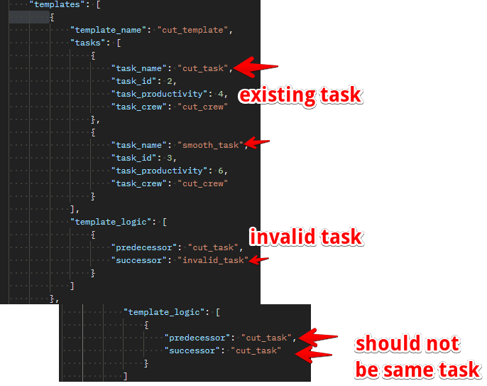

### finish_to_start_lag

> Definition

This key captures the lag for the finish to start activity in the simulation engine. This is captured as a string value from the user and then converted to a timespan before sent across to the engine

> Valid

>> finish_to_start_lag : This value should include string values in time span formats usually set in hours only as displayed below.

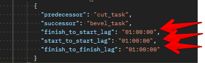

> Invalid

>> finish_to_start_lag : This value cannot contain random or empty string as shown in the image below

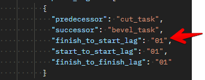

### start_to_start_lag

> Definition

This key captures the lag for the start to start activity in the simulation engine. This is captured as a string value from the user and then converted to a timespan before sent across to the engine

> Invalid

>> start_to_start_lag : This value cannot contain random or empty string as shown in the image below

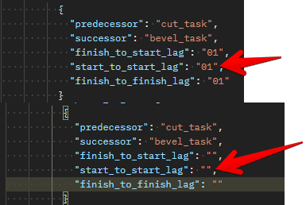

### finish_to_finish_lag

> Definition

This key captures the lag for the finish to finish activity in the simulation engine. This is captured as a string value from the user and then converted to a timespan before sent across to the engine

> Invalid

>> finish_to_finish_lag : This value cannot contain random or empty string as shown in the image below

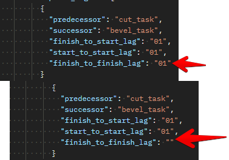

## sample template

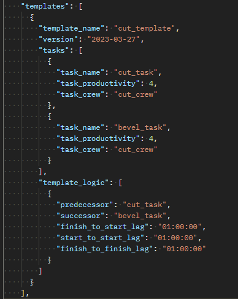
