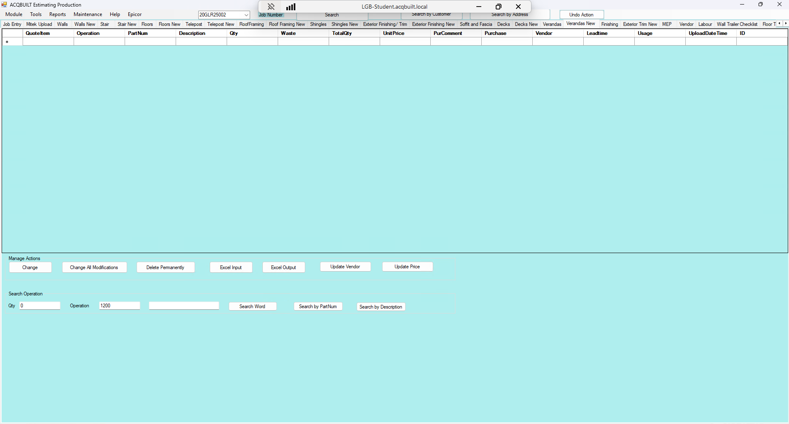

# Verandas New TAB

## Introduction

Verandas New tab allows you to add a BOQ for a specific JOB from EPICOR to be applied to the Verandas. There are two major Actions available on the Verandas tab

- Manage Actions
- Search Operation

### Manage Actions

This enables you to perform the following actions

- Change a Deck Item from BOQ
- Change all Verandas modifications from BOQ
- Delete Verandas BOQ Permanently
- Excel Verandas Input 
- Excel Verandas Output
- Update Verandas Vendor
- Update Verandas Price

### Search Operation

This enables you to perform the following operations

- Enter the **QTY**, **Operation** and **Search Word**.
- Perform Verandas Search in EPICOR
- Perform Verandas Search by **Part Num** in EPICOR
- Perform Verandas Search by **Description** in EPICOR 

## Screenshots

