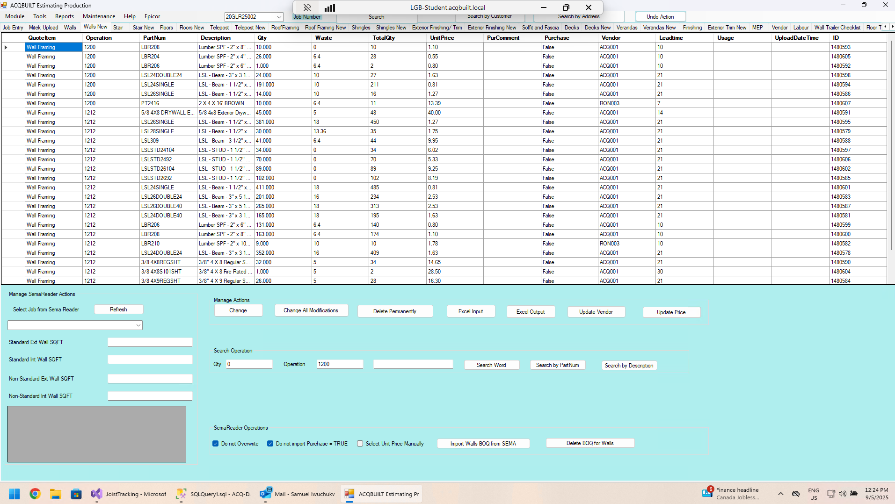

# Walls New

## Introduction

Walls New tab allows you to add a BOQ for a specific JOB from EPICOR. There are four major Actions available on the Walls tab

- Manage SemaReader Actions
- SemaReader Operations
- Manage Actions
- Search Operation

### Manage SemaReader Actions

- Import a Job from Sema Reader
- Refresh Jobs
- Display WallSQFT Calculations

### SemaReader Operations

This enables you to perform the following actions

- Import Walls BOQ from SEMA
- Delete BOQ Walls

### Manage Actions

This enables you to perform the following actions

- Change an Item from BOQ
- Change all modifications from BOQ
- Delete a BOQ Permanently
- Excel Input 
- Excel Output
- Update Vendor
- Update Price

### Search Operation

This enables you to perform the following operations

- Enter the **QTY** , **Operation** and **Search Word**.
- Perform Search in EPICOR
- Perform Search by **Part Num** in EPICOR
- Perform Search by **Description** in EPICOR 

## Screenshots

